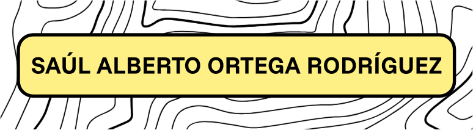

### 🌵 About Me

***

- 🎓 Currently finishing my Higher Vocational Training in Multiplatform Applications Development.

- 🍀 Interested in Software Development and build useful apps.

- 📫 Feel free to contact me.

### 📊 Github Stats

***

### 💼 Experience

***

- [**Aerolaser System, S.L.**](https://aerolaser.es/) | Jan. 2026 - April 2026 (Internship)

- [**Inerza, S.A.**](https://www.inerza.com/) | May. 2025 - June 2025 (Internship)

### 📎 Links

***

