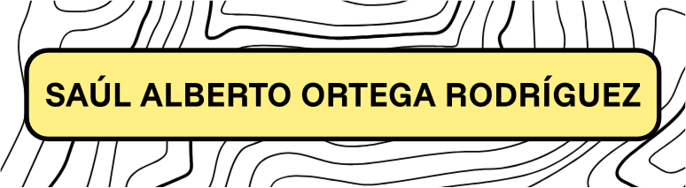

    

***

    <h1>Java Backend Developer</h1>

Oriented to the Java and Spring Boot ecosystem with a double degree in Higher Vocational Training in Multiplatform Applications Development and Finance and Administration.

### 🌵 About Me

***

- 💼 Looking for a new environment where I could contribute and keep growing in my professional career.

- 🍀 Enjoy building from scratch and creating solutions that solves real-life problems.

- 📫 Feel free to contact me.

### 🛠️ Tech Stack

***

**Languages:**

**Frameworks, Libraries & Environments:**

**Databases:**

**Tools & DevOps:**

**Testing:**

### 📂 Projects

***

<table width="100%">
  <tr>
    <td width="50%" valign="top">
      <h3>🏦 <a href="https://github.com/Saul-Ortega/Spanish-Banks-Public-Quarter-Info">Spanish Banks Public Quarter Info</a></h3>
      
Automated scraper and REST API for Spanish bank's quarterly financial data. Built with Java, Spring Boot, Typescript, Puppeteer, PostgreSQL and Docker.

    </td>
    <td width="50%" valign="top">
      <h3>⚙️ <a href="https://github.com/Saul-Ortega/AeApplicationManager">AeApplicationManager</a></h3>
      
Desktop app built with C++ and Qt to manage multiple software versions, track favourites and filter applications in list or grid views.

    </td>
  </tr>
</table>

### 📊 Github Stats

***

    

### 💼 Experience

***

- [**Aerolaser System, S.L.**](https://aerolaser.es/) | Jan. 2026 - April 2026 (Internship)

- [**Inerza, S.A.**](https://www.inerza.com/) | May. 2025 - June 2025 (Internship)

### 📎 Links

***

    
    
    

